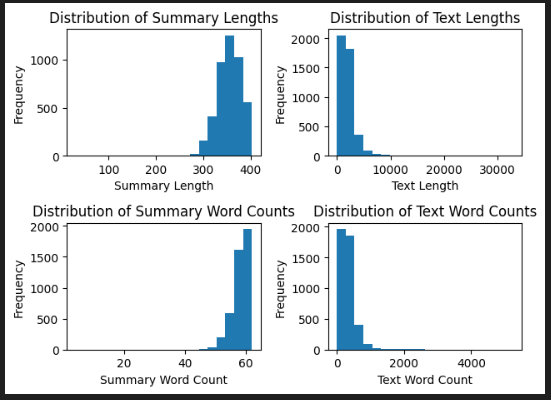
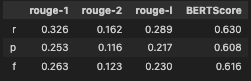
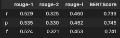

# Abstract

The report outlines steps for loading, inspecting, and preprocessing the dataset to ensure data quality and readiness for analysis. It elaborates on the challenges of loading and training large language models (LLMs) on limited resources, opting for smaller versions of T5 and BART instead. It evaluates model performance using ROUGE metrics, highlighting the superior results of fine-tuned DistilBART over the baseline flan-t5-small. The report includes metric results and emphasizes the effectiveness of DistilBART in preserving original text information. Finally, it provides an example input for inference using the fine-tuned model.


# Data Sanity Checks

### Steps to Check the Quality of the Data

1. **Loading the Dataset**:
   - The dataset was loaded into a pandas DataFrame using `pd.read_csv()`. This step ensures that the data is in a structured format for further analysis and preprocessing.

2. **Initial Inspection**:
   - **Head and Tail**: Used `df.head()` and `df.tail()` to inspect the first and last few rows of the dataset. This helps in understanding the structure and content of the data.
   - **Describe**: Used `df.describe()` to get statistical summaries of the numerical columns, which helps in identifying any anomalies or outliers.

3. **Checking for Missing Values**:
   - Used `df.isna().sum()` to check for missing values in each column. This helps in identifying columns that may require imputation or removal.

4. **Exploratory Data Analysis (EDA)**:
   - **Histograms and Boxplots**: Plotted histograms and boxplots for numerical columns to visualize the distribution and identify any outliers.
  

1. **Data Transformation**:
   - Applied various text preprocessing functions to clean and standardize the text data. This includes expanding contractions, removing punctuation, numbers, stopwords, accented characters, and special characters. For text data, checked for common issues such as:
     - **Contractions**: Expanded contractions using the `expand_contractions` function to ensure consistency in text data.
     - **Punctuation**: Removed punctuation using the `rm_punc_from_text` function to clean the text.
     - **Numbers**: Removed numbers using the `rm_number_from_text` function to focus on textual content.
     - **Stopwords**: Removed stopwords using the `rm_stopwords_from_text` function to reduce noise in the text data.
     - **Accented Characters**: Removed accented characters using the `remove_accented_chars` function to standardize the text.
     - **Special Characters**: Removed special characters using the `remove_special_characters` function to clean the text further.
     - **Additional Cleaning**: Applied the `more_cleaning` function to handle specific text cleaning tasks such as removing extra white spaces, special patterns, and URLs.
  All of this in executed in the `src/preprocess.py` script.

By following these steps, the quality of the data was thoroughly checked and improved, ensuring that it is clean, consistent, and ready for further analysis or modeling.

# Model Selection

## Selecting Models for Text Summarization

When selecting models to summarize text, consider the following factors:

| Criteria                | Option 1                                                                 | Option 2                                                                 |
|-------------------------|--------------------------------------------------------------------------|--------------------------------------------------------------------------|
| **Text Length and Complexity** | **Short to Medium Text:** Models like T5 or BART are effective, as they are pretrained for summarization tasks. | **Long or Complex Text:** Consider hierarchical models like PEGASUS or Longformer, which can handle longer documents efficiently. |
| **Domain Specificity**  | **General Text:** Pretrained models like BART or T5 work well out-of-the-box. | **Domain-Specific Text:** Fine-tuning models like GPT-3 or LLaMA on domain-specific data can yield better summaries. |
| **Resource Constraints**| **Low Resources:** Lightweight models like DistilBART or DistilT5 are faster and require less computation. | **High Resources:** Larger models like GPT-3 or LLaMA offer more nuanced summaries at the cost of higher computational power. |
| **Output Preferences**  | **Abstractive Summarization:** Choose models like BART or T5. | **Extractive Summarization:** Models like BERTSUM are better suited for extracting key sentences. |

In our case, we have `short to medium text`, related to news articles, with low resources and generalized summary should suffice. 

Two good chocies are: **flan-t5-small** and **DistilBART.** 
We have used flan-t5-small as the baseline model and distilbart-cnn-12-6 (trained on CNN news) as our model choice on which our data is trained. Using a pre-trained model on domain-specific data leverages general language understanding while adapting to specific nuances. This approach enhances performance, reduces training time, and efficiently utilizes limited data, making it both effective and cost-efficient.

## Resources used

### Local machine (used for baseline model loading and inference)

- **Processor**: Apple M1 chip with 8-core CPU (4 performance cores and 4 efficiency cores)
- **Memory**: 8GB unified memory

### Cloud - Google Colab (used for training DistilBART training)

- **Processor**:  Virtual CPUs (varying number of cores, typically 2-4)
- **Memory**: 12GB RAM
- **GPU**: Access to NVIDIA T4 - 16 GB

With these resources, it becomes difficult to load and train LLM models like GPT, Llama3, etc. So, our choice of using smaller versions of T5 and BART remains intact.


# Evaluation Metrics


Given that we have a training set with both text and summaries, ROUGE metrics are particularly helpful because they directly compare the model-generated summaries against the reference summaries in the dataset. Specifically:

- **ROUGE-N (ROUGE-1, ROUGE-2)**: Useful for measuring the overlap of unigrams and bigrams between the model-generated summaries and the reference summaries.

- **ROUGE-L:** Helps evaluate whether your model maintains the structure and sequence of the original content.

These metrics are widely used in text summarization tasks and will provide a clear indication of how closely your model's summaries match the reference summaries in your training set.

The metric results for the baseline **flan-t5-small** are given below:



The metric results for the fine-tuned **DistilBART** are given below:



We can observe that the fine-tuned DistilBART gives significantly better scores and is able to preserve a lot more information about the original text in the generated summary.

# Use fine-tuned model for infernce

```
# Use a longer text. Given below is a placeholder example
INPUT = "watch exclusive exposing poor administration amount criticising govt dig roopa india today"

from transformers import pipeline

pipe = pipeline("summarization", model="rrrohit/distilbart-cnn-12-6_finetuned")

pipe(INPUT, max_length=200, min_length=30, do_sample=False)[0]['summary_text']
```

# Future Work

##  Handling Long Documents

> Work-in-progess at `src/chunking.py`

For dealing with long documents, we have used chunking to summarize individual chunks of the long document and then add them up. This handles large documents efficiently, and the text can be broken down into relatively independent segments. This method is suitable for a broad range of documents where global coherence is less critical, or where the focus is on extracting key points from each chunk. 

- **Scalability**: When the document is too long to be processed by standard models due to memory constraints or token limitations (like the max token limit in transformer models).
- **Simplicity**: When the document doesn’t require deep cross-sectional understanding, and a straightforward summarization of chunks is sufficient.
- **Resource Constraints**: When you have limited computational resources, as chunking is simpler and requires less processing power compared to hierarchical models.


## Explainability of the Model

> Work-in-progess at `notebooks/explain_model.py`

SHAP provides a more detailed, model-agnostic explanation. An alternative could be using Attention Visualization (for transformer-based models).

- **Use LLMs to generate better summaries**

- **Parse/convert the generated/predicted text into structured English**

- **Model fine-tuning for longer epochs, trying different learning rates**